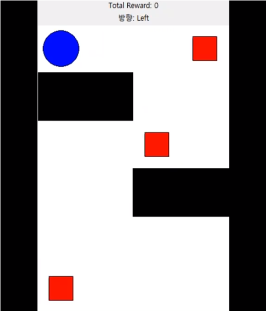
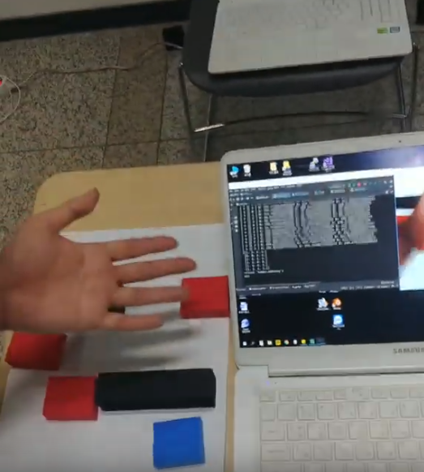

# 스마트 팩토리 구축을 위한 동적인 환경에서의 DQN 강화학습 기반 로봇 최적 이동 경로 탐색 (2019.03.~2019.06)  
* [동영상 링크](https://www.youtube.com/watch?v=HRZD9ABO6vs&t=1s "유튜브")  
* 해당 프로젝트를 주제로 논문을 쓰고 AI 관련 학술대회에 참가하여 수상한 경험이 있습니다. 최근 산업현장에서는 생산성 향상 및 에너지 절감을 위해 스마트 팩토리에 대한 관심이 증가하고 있습니다. 생산 속도 향상 및 에너지 절감 측면에서, 공장 내부에서 사용되는 자율 주행 로봇은부속품을 전달하거나 알람 경보가 발생한 위치로 이동할 때 효율적인 경로로 이동해야 합니다. 현재 스마트 팩토리에서 사용하는 로봇들은 대부분 원격 조종 또는 라인 트레이서 기법으로 대부분 출시되었습니다. 하지만 이러한 방법들은 수시로 변하는 공정 라인 배치와 알람 발생 위치에 적용될 때 경로 이탈, 장애물 충돌 등의 오작동 문제가 발생할 수 있기 때문에 스마트 팩토리에 적용되기에 적합하지 않다고 생각했습니다. 이러한 문제를 해결하기 위해 상황 변화에 능동적이고 유연하게 대처할 수 있는 강화학습 모델을 설계하고자 했습니다. 제가 설계한 모델은 강화학습 알고리즘의 하나인 DQN(Deep Q-network)을 이용한 모델로서 공장 내부 구조를 촬영한 이미지를 받아 현재 로봇의 위치에 대한최적의 이동 경로를 도출해 냅니다. 모의실험 결과, 학습하지 않은 새로운 환경(상황)에서도 최적의 경로로 이동하는 결과를 보임으로써 설계한 모델이 공장 내부의 구조 및 상황들을 고려하여 효율적으로 최적 경로를 도출해내는 것을 확인하였습니다.  
* 전체적인 수행 과정은 다음과 같습니다. 첫째, 천장에서 스마트 팩토리 내부 구조를 CCTV 등을 통해 촬영하고 중앙관리 시스템은 촬영된 이미지를 Wi-Fi와 같은 무선 네트워크를 통해서 전달받습니다. 둘째, 관리 시스템은 이미지 프로세싱 과정을 진행한 뒤 DQN 강화학습을 수행하고 로봇에게 학습한 경험을 바탕으로 수행할 동작을 명령을 내립니다. 셋째, 명령을 받은 로봇은 동작을 진행한 뒤 다음 명령을 기다립니다. 넷째, 로봇이 이동함에 따라 변화한 상태를 이용해 알고리즘을 다시 동작시킵니다. 다섯째, 원하는 동작이 모두 수행될 때까지 처음부터 이를 반복합니다.  
* 길, 로봇, 경유지, 벽 등 변동 요인이 되는 요소를 네트워크를 학습하는 데 사용되는 상태 변수로 정했습니다. 실제 촬영된 이미지의 픽셀을 일정한 간격으로 그룹을 지어 픽셀 그룹 내부의 평균 RGB 값을 계산하여 길, 로봇, 경유지, 벽으로 분류한 뒤 역할에 따라 특정 값을 부여하였습니다. 그리고 이 값들을 한 개의 행으로 나열하고 일차원 배열 형태로 만들었습니다. 현재의 상태에 대한 정보를 의미하는 일차원 배열은 네트워크를 학습할 때 사용하였습니다. 이를 통해 에이전트는 현재 환경에 대한 상태를 쉽게 파악할 수 있고, 이미지 전체가 입력층으로 들어가는것보다 저장 공간이 절약되고 빠른 학습을 진행할 수 있었습니다.  
* 강화학습 모델은 DQN 모델을 이용하였고, 학습을 위한 에이전트인 메인 네트워크와 실제 값을 구하기 위한 타겟 네트워크 등으로 구성하였습니다. 또한, 과거 에피소드를 저장한 버퍼를 사용하였으며, 버퍼에서 일정 개수만큼 랜덤 샘플을 추출하여 학습하였습니다. Deep Q-Network는 에이전트 내부에 속하며 에이전트가 DQN을 거쳐서 나온 Q 함수의 값을 토대로 epsilon-greedy 방법을 사용해 행동을 선택하면 환경이 현재 상태와 행동에 따른 보상을 주고 다음 상태를 다시 에이전트에게 전달합니다. &lt;현재 상태, 행동, 보상, 다음 상태&gt; 형태의 훈련 데이터(Training set)가 되어 재현 저장소(Replay memory)에 저장이 되고, 에이전트는 그중에서 지정된 배치(batch) 크기만큼 무작위로 훈련 데이터를 추출하여 손실 함숫값이 최소화되도록 타겟 네트워크 내부의 가중치(weight)와 바이어스(bias)를 업데이트합니다. 다양한 상황에 대해 에피소드를 반복 학습하여 가중치와 바이어스의 과적합(overfitting)을 막고, 효율적인 학습을 진행하였습니다.  
* 해당 알고리즘을 구현하기 위해 Python 언어와 오픈 소스 신경망 라이브러리인 Keras를 사용하여 인공신경망을 생성하였고, 활성화 함수와옵티마이저를 이용하여 이를 최적화했습니다. OpenCV를 이용하여 웹캠에서 촬영한 이미지의 픽셀 그룹 별 평균 RGB를 측정하였고, 이를 1차원 배열 형태로 만들어주는 코드를 구성했습니다. 그리고 GUI 툴인 Tkinter 모듈을 사용하여 결과 시뮬레이션을 위한 사용자 인터페이스를구현했습니다.  
    
  

### 2019 인하대학교 정보통신공학과 졸업 프로젝트 '스팩'팀

           인하대학교 정보통신공학과 박광석  
           인하대학교 정보통신공학과 박진만  
           인하대학교 정보통신공학과 유상조 교수님  
